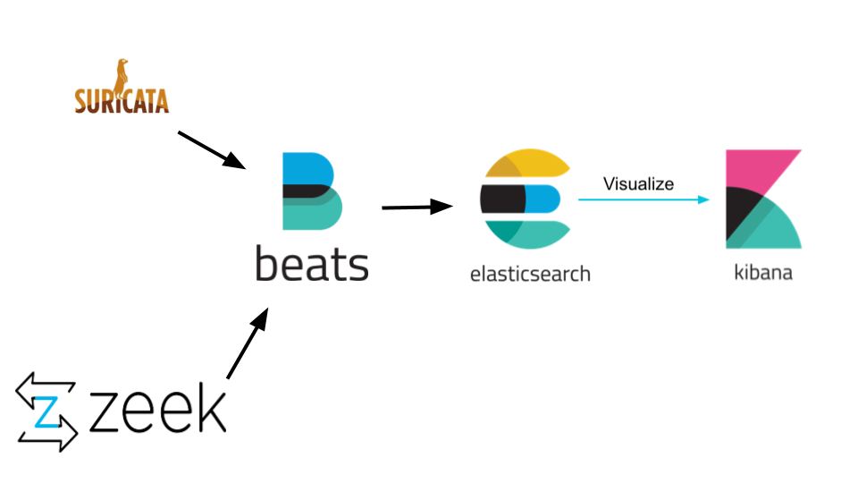

Intrusion Detection System - Tool Descriptions

This project integrates several powerful tools to build a functional IDS (Intrusion Detection System). Each component in the stack plays a unique role in monitoring, capturing, processing, and visualizing network data.

1. Suricata

Suricata is an open-source network threat detection engine capable of real-time intrusion detection (IDS), intrusion prevention (IPS), and network security monitoring (NSM). It inspects traffic using rules and signatures and can log protocol information, alerts, and metadata.

Use Case:
- Detects known attack patterns
- Generates alerts when suspicious packets are detected
- Parses protocols like HTTP, DNS, TLS, etc.

sudo apt install suricata

sudo suricata-update

cd /tmp/ && curl -LO https://rules.emergingthreats.net/open/suricata-6.0.8/emerging.rules.tar.gz

sudo tar -xvzf emerging.rules.tar.gz

sudo mv rules/* /etc/suricata/rules/

sudo chmod 640 /etc/suricata/rules/*

sudo systemctl restart suricata

2. Zeek

Zeek (formerly known as Bro) is a powerful network analysis framework that focuses on application-level traffic analysis. It does not rely on signatures like Suricata but instead logs activity and can detect anomalies through policy scripts.

Use Case:
- Deep network traffic logging
- Behavioral analysis
- Creates readable logs in JSON or plain text format

sudo apt-get update

sudo apt-get install -y --no-install-recommends g++ cmake make libpcap-dev

echo 'deb http://download.opensuse.org/repositories/security:/zeek/xUbuntu_22.04/ /' | sudo tee /etc/apt/sources.list.d/security:zeek.list

curl -fsSL https://download.opensuse.org/repositories/security:zeek/xUbuntu_22.04/Release.key | gpg --dearmor | sudo tee /etc/apt/trusted.gpg.d/security_zeek.gpg > /dev/null

sudo apt update

sudo apt install zeek-6.0
./configure --prefix=/opt/zeek
make -j$(nproc)
sudo make install

echo 'export PATH=$PATH:/opt/zeek/bin' >> ~/.bashrc
source ~/.bashr

3. Filebeat

Filebeat is a lightweight shipper for forwarding and centralizing log data. It monitors log files and sends them to a destination like Elasticsearch. In this setup, it is used to ship Suricata and Zeek logs to Elasticsearch for indexing.

Use Case:
- Monitors Zeek and Suricata log directories
- Ships logs to Elasticsearch securely and efficiently

sudo apt install filebeat

4. Elasticsearch

Elasticsearch is a distributed search and analytics engine that stores and indexes data for fast search and retrieval. It receives structured logs from Filebeat and indexes them to make them searchable.

Use Case:
- Stores and indexes logs from Filebeat
- Supports full-text search and data aggregation

sudo apt install elasticsearch

5. Kibana

Kibana is a visualization tool for Elasticsearch data. It allows users to build dashboards, visualizations, and search logs interactively. It helps in understanding patterns, anomalies, and security incidents by visualizing the raw data.

Use Case:
- Visualizes IDS alerts and logs from Zeek and Suricata
- Allows filtering, searching, and dashboard creation
- Enables security analysts to gain insights quickly

sudo apt install kibana

Summary:

- Suricata: Signature-based IDS
- Zeek: Behavior-based traffic analyzer
- Filebeat: Log shipper
- Elasticsearch: Storage and indexing engine
- Kibana: Data visualization and exploration

These tools, when integrated together, form a comprehensive network security monitoring system.
